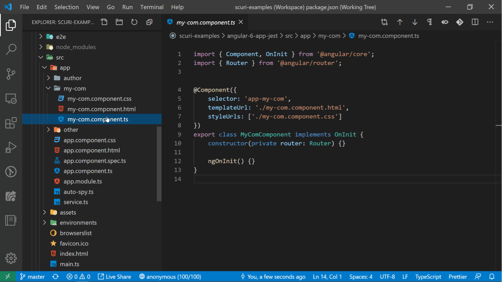
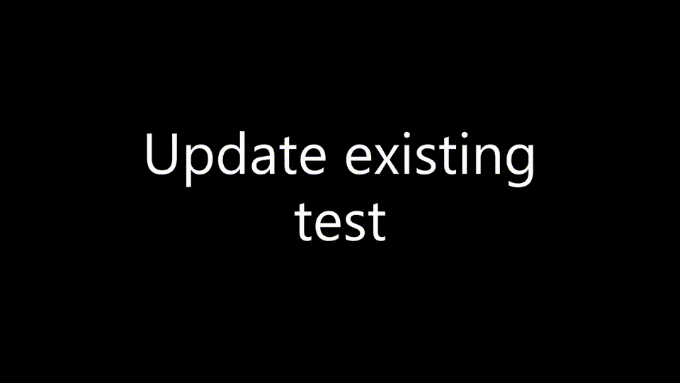
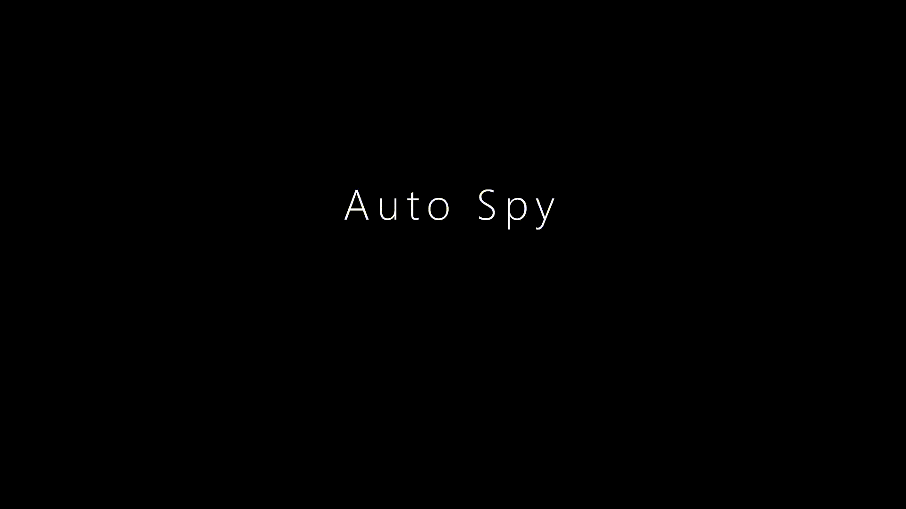

# SCuri[\*](#scuri-name)

<!-- ALL-CONTRIBUTORS-BADGE:START - Do not remove or modify this section -->

[](https://dev.azure.com/gparlakov/Scuri/_build/latest?definitionId=6&branchName=master) [](#contributors-)

<!-- ALL-CONTRIBUTORS-BADGE:END -->

### **Automates unit test boilerplate** for **Angular** components/services/directives/etc. It will **generate** spec for you and help you **update** it when dependencies are added or removed!

<br />

> _Powered by [Schematics](https://angular.io/guide/schematics) and [TypeScript compiler](https://github.com/microsoft/TypeScript/wiki/Using-the-Compiler-API)_

## Links

[](https://marketplace.visualstudio.com/items?itemName=gparlakov.scuri-code) [VS Code extension](https://marketplace.visualstudio.com/items?itemName=gparlakov.scuri-code) available!

🤙 Have some feedback or need a feature? [SCuri discussion on github](https://github.com/gparlakov/scuri/discussions/110)

🤵[Need commercial-quality coverage for SCuri?](#scuri-for-enterprise)

💵[Support us](#like-it)

## Why?

**After** a component has been **created** it is **boring and tedious** to do the tests - and we often **don't**. SCuri[\*](#scuri-name) tries to jump-start that by walking the component's constructor, parsing the dependencies and creating mocks for each of them, and then including them in the spec.

## Features

### Create a test case from scratch



The video shows how to use `schematics scuri:spec --name src\app\my-com\my-com.component.ts` to create a spec from scratch (if already created see **update** or use **--force** to overwrite).

> For Angular CLI >= 6 `ng g scuri:spec --name src\app\my-com\my-com.component.ts` could be used instead.

> **--name** is now optional `ng g scuri:spec my-com.component.ts` or `npx schematics scuri:spec my-com.component.ts`

See details [down here](#create-spec-from-scratch).

### Update existing test



Shows how we begin with an outdated test:

- missing `it` test case for one of the public methods (`getData`)
- missing dependency `HttpClient` to instantiate the component

And after `schematics scuri:spec --name src\app\my-com\my-com.component.ts --update` command we get the updated test - dependency and a scaffold test case added.

> For Angular CLI >= 6 `ng g scuri:spec --name src\app\my-com\my-com.component.ts --update` could be used instead.

See details [down here](#update-existing-spec)

### AutoSpy


Generates an `autoSpy` function that takes a type and returns an object with the same type plus all its methods are mocked i.e. `jasmine.spy()` or `jest.fn()`.

See details [down here](#autospy-1).
Needs tsconfig path setup -> [there](#autospy-and-typescript).

## Getting started / Setup

Using VS Code? Just install the [**SCuri** VS Code extension](https://marketplace.visualstudio.com/items?itemName=gparlakov.scuri-code)

### Command line setup

1. Install deps

    ```bash
    npm install -D scuri
    ng g scuri:spec --name src/app/app.component.ts
    ```

2. Generate autospy

    ```bash
    ng g scuri:autospy
    ```

    [Details and older Angular versions](#autospy-1)
3. Tell **Typescript** where to find `autospy` by adding `autospy` to `paths`:

    ```json
    {
        ...
        "compilerOptions": {
            ...
            "baseUrl": ".",
            "paths": {
                "autospy": ["./src/auto-spy"]
            }
        }
    }
    ```

    Details [here](#Autospy-and-Typescript)

4. Start using scuri:

    ```sh
    ng g scuri:spec --name src/app/app.component.ts
    ```

If you get `Error: Invalid rule result: Function().` see the [troubleshooting section below](#rule-result-function).

## Details

### Create spec from scratch

```sh
ng g scuri:spec --name src/app/app.component.ts
```

or

```sh
npx schematics scuri:spec --name src/app/app.component.ts
```

Requires `--name` - an existing `.ts` file with one `class` (Component/Service/Directive/etc.) and NONE existing `.spec.ts` file.

### Overwrite existing spec

```sh
ng g scuri:spec --name src/app/app.component.ts --force
```

or

```sh
npx schematics scuri:spec --name src/app/app.component.ts --force
```

Requires `--name` - an existing `.ts` file with one `class` (Component/Service/Directive/etc.). Will overwrite any existing `.spec.ts` file.

> This might be useful in certain more complex cases. Using a diff tool one could easily combine the preexisting and newly created (overwritten) content - just like a merge conflict is resolved.

### Update existing spec

```sh
ng g scuri:spec --name src/app/app.component.ts --update
```

or

```sh
npx schematics scuri:spec --name src/app/app.component.ts --update
```

Requires `--name` - an existing `.ts` file with one `class` (Component/Service/Directive/etc.) and one existing `.spec.ts` file where the update will happen.

### AutoSpy

To generate an `auto-spy.ts` file with the type and function which can be used for automating mock creation, use:

`ng g scuri:autospy`

See the [Autospy](https://github.com/gparlakov/scuri/wiki/Autospy) wiki page.

#### Using older versions of Angular?

-   Angular v5, v4, v2:
    `bash npm i -g @angular-devkit/schematics-cli npm i -D scuri schematics scuri:autospy --legacy`
    _Notice the --legacy flag. It's required due to typescript being less than 2.8. See flags below_

#### Using Jest

`ng g scuri:autospy --for jest`

Or

`schematics scuri:autospy --for jest`

Versions and flags

| angular        | jest / jasmine | command                                        |
| -------------- | -------------- | ---------------------------------------------- |
| 2,4,5          | jasmine        | `schematics scuri:autospy --legacy`            |
|                | jest           | `schematics scuri:autospy --for jest --legacy` |
| 6, 7, 8 and up | jasmine        | `ng g scuri:autospy`                           |
|                | jest           | `ng g scuri:autospy --for jest`                |

All Angular versions after and including 6 can use the Angular CLI - `ng generate scuri:autospy`.

Flags:

-   `--for` with accepted values `jest` and `jasmine` (default is `jasmine`)
-   `--legacy` for generating a type compatible with typescript < 2.8 (namely the conditional types feature)

Examples:
`ng g scuri:autospy --for jest --legacy` would generate a ts<2.8, jest-compatible `autoSpy` type and function
`ng g scuri:autospy` would generate a ts>2.8, jasmine-compatible `autoSpy` type and function

### Autospy and Typescript

After creating the `auto-spy.ts` file as a result of the `scuri:autospy` schematic invocation we need to make sure its properly imported in our tests. To that end and keeping in mind that `autoSpy` is being imported in the created tests as `import { autoSpy } from 'autoSpy';`. To make that an actual import one could add this line to `tsconfig.json`:

```json
{
    "compilerOptions": {
        "baseUrl": ".", // This must be specified if "paths" is.
        "paths": {
            "autospy": ["./src/auto-spy"] // This mapping is relative to "baseUrl"
        }
    }
}
```

This is assuming `auto-spy.ts` was created inside `./src` folder. Edit as appropriate for your specific case.

See [here](https://www.typescriptlang.org/docs/handbook/module-resolution.html#path-mapping) for **path** details

## 🛣 Road map <a id="road-map" href="#road-map">~</a>

-   [x] Create spec from scratch (or overwrite existing with `--force`)
-   [x] Update existing spec - add/remove dependencies
-   [x] Create one scaffold `it` test case for each public method
-   [x] On Update add `it`-s for newly added public methods
-   [x] Generate autoSpy by `scuri:autospy` (support jest, jasmine and ts with and w/o conditional types)
-   [x] Support traditional Angular cli generated tests (with `--update`)
    -   [x] Add `setup` function when missing
    -   [x] Update dependencies
-   [x] Allow configuration via file (.scuri.json)
-   [ ] ([workaround](#autospy-and-typescript)) Import `autoSpy` function automatically - now imported as `import { autoSpy } from 'autoSpy';`

## S.C.u.r.i. <a id="scuri-name" href="#scuri-name">\*</a>

What's with the name?

A spec generator schematic - **S**pec **C**reate **U**pdate **R**ead (class - component, service, directive and dependencies) **I**ncorporate (them in the spec generated/updated)

## Configuring

Scuri can use configuration from the following list by default (package.json .scurirc .scurirc.json .scurirc.yml .scurirc.yaml scurirc.js scurirc.config.js).

### Example package.json

```json
{
  "name": "my-app",
  ...
  "scuri": {
      "classTemplate": "src/templates/__specFileName__.template"
  }
}
```

### Example .scurirc

```json
{
    "classTemplate": "src/templates/__specFileName__.template"
}
```

### Supported configuration

-   **classTemplate** - a location of a custom class template to be used. Here's a [gist](https://gist.github.com/gparlakov/f299011829e229c9d37cf0cb38506d97) of starter template that explains what properties are available to the class template
    -   starter [https://gist.github.com/gparlakov/f299011829e229c9d37cf0cb38506d97](https://gist.github.com/gparlakov/f299011829e229c9d37cf0cb38506d97)
    -   issue with a specific example [link](https://github.com/gparlakov/scuri/issues/32#issuecomment-946332209)

## 🐱‍💻 Troubleshooting

### Rule result Function

To workaround the `Error: Invalid rule result: Function().` install schematics separately and call `scuri` with that.

```sh
npm install -D scuri
npm i -g @angular-devkit/schematics-cli
schematics scuri:spec --name src/app/app.component.ts
```

or if you don't want to install the `schematics` cli globally and have `npm version 6 and above` you can

```sh
npm install -D scuri @angular-devkit/schematics-cli
npx schematics scuri:spec --name src/app/app.component.ts
```

## Contributing

[Link](./CONTRIBUTING.md)

## SCuri for enterprise

Available as part of the Tidelift Subscription

The maintainers of SCuri and thousands of other packages are working with Tidelift to deliver commercial support and maintenance for the open-source dependencies you use to build your applications. Save time, reduce risk, and improve code health, while paying the maintainers of the exact dependencies you use. [Learn more.](https://tidelift.com/subscription/pkg/npm-scuri?utm_source=npm-scuri&utm_medium=referral&utm_campaign=enterprise&utm_term=repo)

## Contributors ✨

Thanks goes to these wonderful people ([emoji key](https://allcontributors.org/docs/en/emoji-key)):

<!-- ALL-CONTRIBUTORS-LIST:START - Do not remove or modify this section -->
<!-- prettier-ignore-start -->
<!-- markdownlint-disable -->
<table>
  <tr>
    <td align="center"><a href="https://github.com/gparlakov"><br /><sub><b>Georgi Parlakov</b></sub></a><br /><a href="https://github.com/Georgi Parlakov/scuri/commits?author=gparlakov" title="Code">💻</a> <a href="#ideas-gparlakov" title="Ideas, Planning, & Feedback">🤔</a> <a href="https://github.com/Georgi Parlakov/scuri/commits?author=gparlakov" title="Documentation">📖</a> <a href="https://github.com/Georgi Parlakov/scuri/commits?author=gparlakov" title="Tests">⚠️</a></td>
    <td align="center"><a href="https://github.com/tziyang-lum"><br /><sub><b>Tzi Yang</b></sub></a><br /><a href="https://github.com/Georgi Parlakov/scuri/issues?q=author%3Atziyang-lum" title="Bug reports">🐛</a></td>
    <td align="center"><a href="https://github.com/fgisslen"><br /><sub><b>fgisslen</b></sub></a><br /><a href="https://github.com/Georgi Parlakov/scuri/issues?q=author%3Afgisslen" title="Bug reports">🐛</a></td>
     <td align="center"><a href="https://github.com/danielberebel"><br /><sub><b>danielberebel</b></sub></a><br /><a href="https://github.com/Georgi Parlakov/scuri/issues?q=author%3Afgisslen" title="Bug reports">🐛</a></td>
  </tr>
</table>

<!-- markdownlint-enable -->
<!-- prettier-ignore-end -->

<!-- ALL-CONTRIBUTORS-LIST:END -->

This project follows the [all-contributors](https://github.com/all-contributors/all-contributors) specification. Contributions of any kind welcome!

## Like it?

You like the project and it gives you value? You are considering supporting it? That would be really appreciated!

<a class="bmc-button" target="_blank" href="https://www.buymeacoffee.com/bHQk8Cu">☕<span style="margin-left:5px;">Buy us a coffee</span></a>
