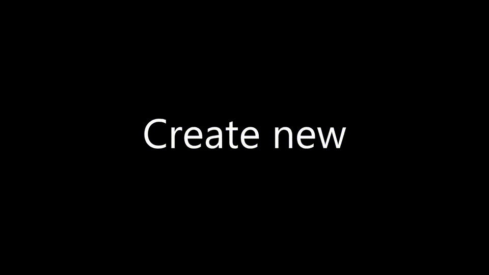

# SCuri

A spec generator schematic - **S**pec **C**reate **U**pdate **R**ead (class - component, service, directive and dependencies) **I**ncorporate (them in the result)

It generates/updates tests for Angular components/services/directives..

## Features
### Create test from scratch



The video shows how to use `schematics scuri:spec --name src\app\my-com\my-com.component.ts` to create a spec from scratch (if already created see **update** or use **--force** to overwrite)

### Update existing test


Shows how we begin with an outdated test:
 - missing `it` test case for one of the public methods (`getData`)
 - missing dependency `HttpClient` to instantiate the component

And after `schematics scuri:spec --name src\app\my-com\my-com.component.ts --update` command we get the updated test - dependency and a scaffold test case added

### AutoSpy


## Use case

After a component has been created it is boring and tedious to do the tests. Scuri tries to jump start that by walking the components constructor and dependencies and creating mocks for each dependency.

## Getting started / Setup
```
npm install -D scuri
ng g scuri:spec --name src/app/app.component.ts
```

If you gen error of the `Error: Invalid rule result: Function().` see the [troubleshooting section below](#rule-result-function).


## Details
### Update existing spec

```
ng g scuri:spec --name src/app/app.component.ts --update
```

or

```
npx schematics scuri:spec --name src/app/app.component.ts --update
```

### AutoSpy

To generate an `auto-spy.ts` file with the type and function which can be used for automating mock creation, use:
 - ``` schematics scuri:autospy ``` - for angular 5 and previous
 - ``` ng g scuri:autospy ``` for angular 6 and up
Both cases requires `npm i scuri` (or `npm i -g scuri`) and the first requires `npm i -g @angular-devkit/schematics-cli`.

It supports the following flags:
 - `--for` with accepted values `jest` and `jasmine` (default is `jasmine`)
 - `--legacy` for generating a type compatible with typescript < 2.8 (namely the conditional types feature)

Examples:
`ng g scuri:autospy --for jest --legacy` would generate a ts<2.8 jest compatible `autoSpy` type and function
`ng g scuri:autospy` would generate a ts>2.8 jasmine compatible `autoSpy` type and function

## 🛣 Road map
 - [x] Create spec from scratch (or overwrite existing with `--force`)
 - [x] Update existing spec - add/remove dependencies
 - [x] Create one scaffold `it` test case for each public method
 - [x] On Update add `it`-s for newly added public methods
 - [x] Generate autoSpy by `scuri:autospy` (support jest, jasmine and ts with and w/o conditional types)
 - [ ] Auto import `autoSpy` function (now imported as `import { autoSpy } from 'autoSpy'`;)
 - [ ] Support traditional Angular cli generated tests (with `--update`)
   - [ ] Add `setup` function when missing
   - [ ] Update dependencies

## 🐱‍💻Troubleshooting

### Rule result Function

To workaround the `Error: Invalid rule result: Function().` install schematics separately and call `scuri` with that.

```
npm install -D scuri
npm i -g @angular-devkit/schematics-cli
schematics scuri:spec --name src/app/app.component.ts
```

or if you don't want to install the `schematics` cli globally and have `npm version 6 and above` you can

```
npm install -D scuri @angular-devkit/schematics-cli
npx schematics scuri:spec --name src/app/app.component.ts
```

## Contributing

### Clone and run

In this example I clone `https://github.com/gparlakov/scuri`. If you want to contribute fork and clone your own forked repo.

```
git clone https://github.com/gparlakov/scuri
cd scuri
npm install
npm install -g @angular-devkit/schematics-cli
npm run build
schematics .:spec --name example/example.component.ts
```

Or use the package.json/scripts I'm using in the day-to-day development to speed things up instead of the last three lines from above example.

```
npm run build.run -- --force --dry-run false
```

-   `--force` is required because there is already an example.component.spec.ts file
-   `--dry-run false` is required because by default when running local schematics they are run in --dry-run mode - which only shows the expected actions and outcomes but does not actually modify the files on the filesystem

### Use in an Angular app

In this example I'm using the `example/angular-5-app` bundled with this repo. Feel free to use any Angular application you work on

```
cd #into-my-scuri-cloned-src-folder
npm link
cd example\angular-5-app
npm link scuri
ng g scuri:spec --name src/app/app.component.ts --force
```

-   `cd #into-my-scuri-cloned-src-folder` or wherever you cloned the source - for example `cd scuri`
-   `npm link` links to the current folder
-   `cd example\angular-5-app` or any real angular application
-   `npm link scuri` # links scuri to the current folder/packages - as if - you've installed it like npm i -D scuri
-   `ng g scuri:spec --name src/app/app.component.ts --force` # force to overwrite the current spec

### Unit Testing

Single run:

```
npm run test
```

Runs the unit tests, using Jasmine as a runner and test framework. It builds the spec schematic, then builds the test in `/tests` and runs them.

Or watch and run:

```
npm run watch.test
```

Will do the same as above but will also watch for file changes and re-run the tests.
